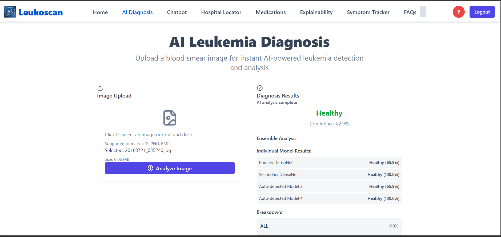
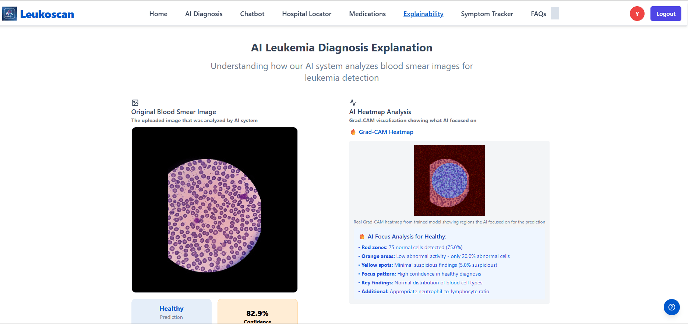
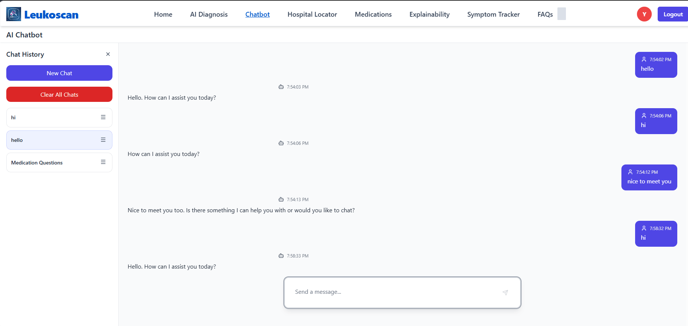
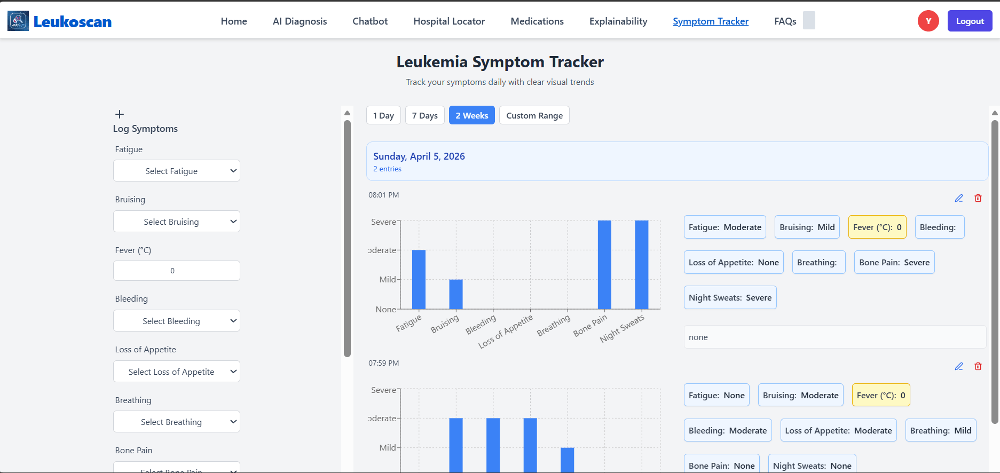
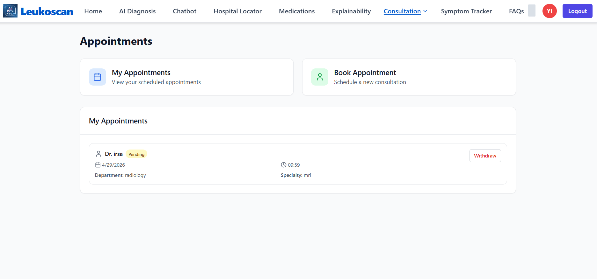

 Leukoscan — AI-Powered Leukemia Detection Platform

Leukoscan is a full-stack web application that uses deep learning to assist in the detection of leukemia from blood smear images. Built as a Final Year Project (FYP), it combines an ensemble of computer vision models with explainability tools, a symptom tracker, a medication guide and an AI chatbot to create an end-to-end support system for leukemia awareness and early screening.

 ⚠️ **Disclaimer:** Leukoscan is an academic/research project and is **not** a certified medical device. It is not intended to diagnose, treat or replace professional medical advice. Always consult a qualified healthcare provider for medical concerns.

✨ Features

 🧠 AI Diagnosis
Upload a blood smear image (JPG, PNG or BMP) and get an instant prediction from an **ensemble of deep learning models** (Primary DenseNet, Secondary DenseNet and additional auto-detected models). The system aggregates individual model outputs into a final prediction with a confidence score and a breakdown by leukemia subtype (e.g., ALL).

 🔍 Explainability (Grad-CAM)
Understand *why* the model made its prediction. Leukoscan generates **Grad-CAM heatmaps** highlighting the regions of the blood smear the AI focused on, alongside a plain-language breakdown of red/orange/yellow zones, cell counts and key findings.

💬 AI Chatbot
An integrated conversational assistant lets users ask questions, with full chat history saved and manageable (new chat, clear history, multiple sessions).

 💊 Medication Guide
A searchable database of ** FDA-approved leukemia medications**, filterable by leukemia type, including generic names, brand names, approval status and detailed descriptions with alternatives.

 📊 Symptom Tracker
Log daily symptoms (fatigue, bruising, fever, bleeding, loss of appetite, breathing difficulty, bone pain, night sweats) and visualize trends over custom date ranges with interactive charts.

 🏥 Hospital Locator & Consultation
Find nearby hospitals/specialists and book consultation appointments directly through the platform, with appointment status tracking (pending, confirmed, withdrawn).

❓ FAQs
A dedicated knowledge base answering common questions about leukemia, diagnosis and platform usage.

